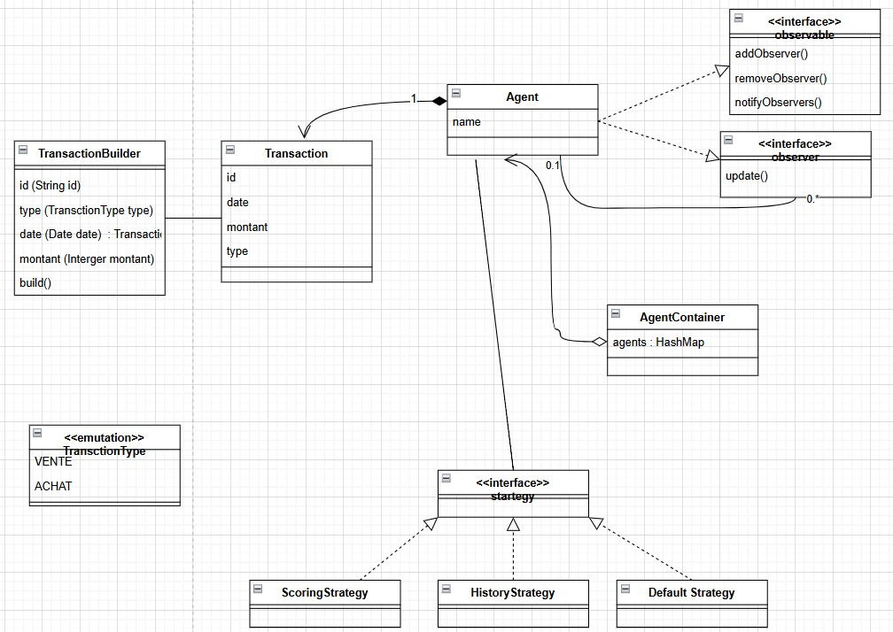
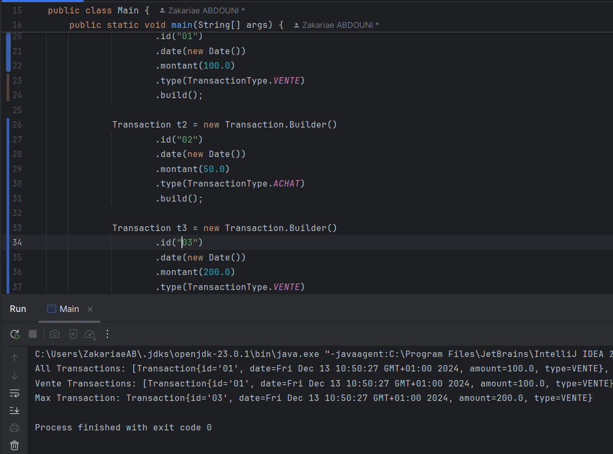
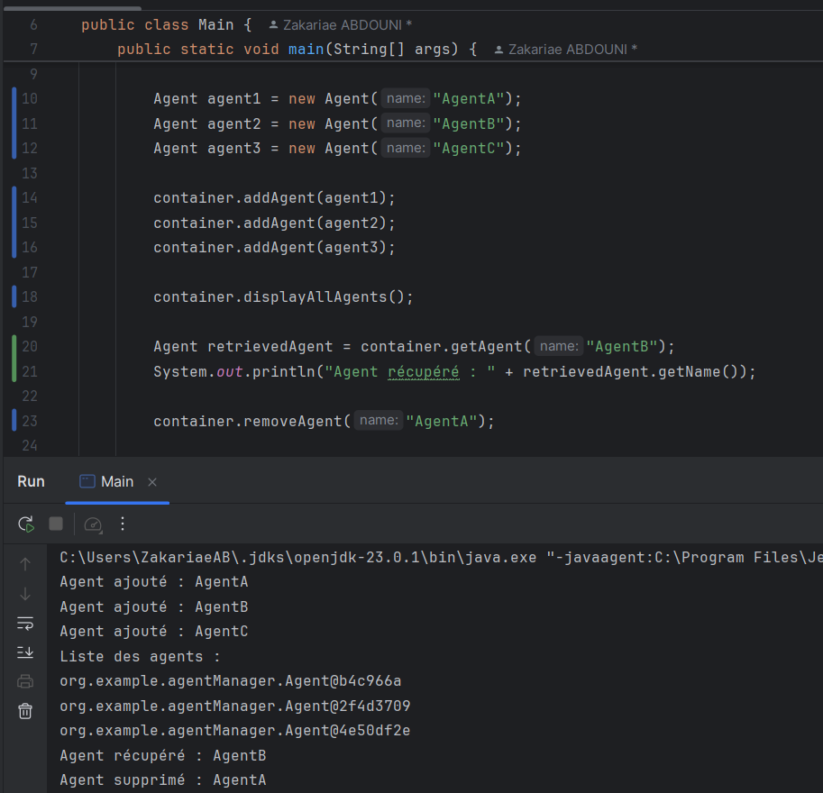
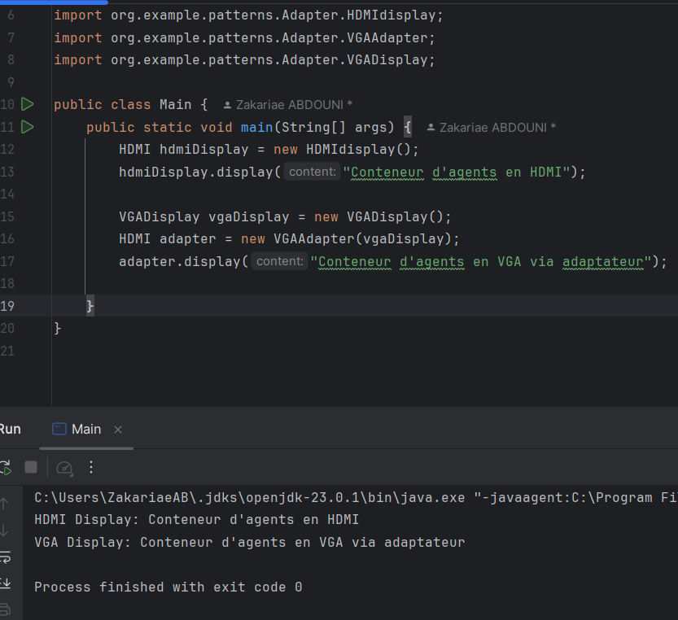

# **Examen design pattern et Programmation Orientée Aspect**

---

## **Fonctionnalités**
1. **Gestion des agents** :
    - Chaque agent peut gérer une liste de transactions (achats ou ventes).
    - Les agents peuvent s’abonner entre eux pour recevoir des notifications lors de l’ajout de nouvelles transactions.

2. **Annotations personnalisées** :
    - **`@Log`** : Journalise la durée d'exécution des méthodes annotées.
    - **`@Cachable`** : Met en cache la méthode retournant la transaction ayant le plus grand montant pour optimiser les performances.
    - **`@SecuredBy`** : Protéger certaines méthodes avec un système de rôles utilisateur.
    - 
3. **Gestion des transactions** :
    - Création et manipulation de transactions avec le **Pattern Builder**.
    - Recherche de la transaction avec le montant le plus élevé.

4. **Design Patterns utilisés** :
    - **Builder** : Pour la création de transactions.
    - **Observer** : Pour les notifications entre agents.
    - **Strategy** : Pour personnaliser le traitement des notifications.
    - **Singleton** : Pour garantir une instance unique du conteneur d’agents.
    - **Adapter** 
---

## **1. Diagramme de classe simplifié**
Un diagramme de classe a été créé pour illustrer la structure statique du modèle et les design patterns utilisés dans l’application. Voici les éléments clés du diagramme :
- **Transaction** : Représente une transaction effectuée par un agent.
- **Agent** : Gère une collection de transactions et reçoit des notifications.
- **Container** : Contient et gère les agents.
- **Observer** : Pour gérer les abonnements entre agents (Pattern Observer).
- **Strategy** : Permet de définir différentes stratégies de traitement des notifications.

  
---

## **2. Implémentation et Test de la Classe `Transaction`**
La classe `Transaction` est utilisée pour créer et gérer les transactions. Elle utilise le pattern **Builder** pour faciliter la création d'objets complexes.

### Extrait du Code de la classe `Transaction` :
```java
public class Transaction {
    private String id;
    private java.util.Date date;
    private double montant;
    private TransactionType type;

    // Builder
    public static class Builder {
        private Transaction transaction;

        public Builder() {
            transaction = new Transaction();
        }
```
### Test du code 

## **2. Implémentation et Test de la Classe `Agent`**
### Extrait du Code de la classe `Agent` :
```java

public class Agent implements Observer, Observable {
    private final String name;
    private final List<Transaction> transactions;
    private final List<Observer> observers;
    private Strategy strategy;

    public Agent(String name) {
        this.name = name;
        this.transactions = new ArrayList<>();
        this.observers = new ArrayList<>();
        this.strategy = new DefaultStrategy();
    }

    public String getName() {
        return name;
    }

    @Override
    public void addObserver(Observer observer) {
        observers.add(observer);
    }

    @Override
    public void removeObserver(Observer observer) {
        observers.remove(observer);
    }

    @Override
    public void notifyObservers(Transaction transaction) {
        for (Observer observer : observers) {
            observer.update(this.name, transaction);
        }
    }
```
### Test du code


## **3. Implémentation et Test de la Classe `Container`**
### Extrait du Code de la classe `Container` :
```java
public class Container {
    private static Container instance;
    private final Map<String, Agent> agents;

    private Container() {
        this.agents = new HashMap<>();
    }

    public static synchronized Container getInstance() {
        if (instance == null) {
            instance = new Container();
        }
        return instance;
    }

    public void addAgent(Agent agent) {
        if (agent != null && !agents.containsKey(agent.getName())) {
            agents.put(agent.getName(), agent);
            System.out.println("Agent ajouté : " + agent.getName());
        } else {
            System.out.println("L'agent existe déjà ou est invalide.");
        }
    }
```

## **4. Autres Design Patterns**
### Extrait du Code :
```java
public class HDMIdisplay implements HDMI {
    @Override
    public void display(String content) {
        System.out.println("HDMI Display: " + content);
    }
}


```
### Test du code



## **5. Implémentation des Aspects Techniques**
### Extrait du Code de la classe `@Log` :
```java
@Target(ElementType.METHOD)
@Retention(RetentionPolicy.RUNTIME)
public @interface Log {
}
```
### Extrait du Code de la classe `@Cachable ` :
```java
@Target(ElementType.METHOD)
@Retention(RetentionPolicy.RUNTIME)
public @interface Cachable {
}
```
### Extrait du Code de la classe `@SecuredBy` :
```java
@Target(ElementType.METHOD)
@Retention(RetentionPolicy.RUNTIME)
public @interface SecuredBy {
    String[] roles() default {};
}
```
